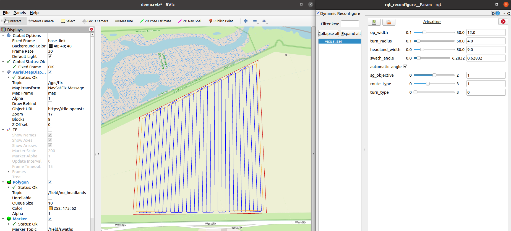

# Fields2Cover ROS

This package is an interface to ROS of the [Fields2Cover library](https://github.com/Fields2Cover/Fields2Cover)

## Pre-requisites

This code has been tested with Ubuntu 20.04 and ROS noetic.

First, install [ROS noetic](http://wiki.ros.org/noetic/Installation/Ubuntu) and create a [workspace (from now: catkin_ws/ )](http://wiki.ros.org/catkin/Tutorials/create_a_workspace). 


Also compile and install the [Fields2Cover library](https://github.com/Fields2Cover/Fields2Cover).

Under `catkin_ws/src` clone the `rviz_satellite` and this package:
```
git clone https://github.com/nobleo/rviz_satellite
git clone https://github.com/Fields2Cover/fields2cover_ros
```

## Compilation

From the workspace folder (`catkin_ws/`), run:

```
catkin_make
```

## Running a demo

To run an interactive demo, run:

```
roslaunch fields2cover_ros view_field.launch
```

A rviz and a rqt_reconfigure windows will appear, so you can interactively modify the path created:




## Citing


Please cite the [following paper](https://arxiv.org/abs/2210.07838) when using Fields2Cover for your research:

```
@article{Mier_Fields2Cover_An_open-source_2022,
  author = {Mier, Gonzalo and Valente, João and de Bruin, Sytze},
  doi = {https://doi.org/10.48550/arXiv.2210.07838},
  journal = {arXiv},
  title = {{Fields2Cover: An open-source coverage path planning library for unmanned agricultural vehicles}},
  year = {2022}
}  
```


## Credits and more info

This code repository is part of the project Fields2Cover which is (partly) financed by the Dutch Research Council (NWO).


